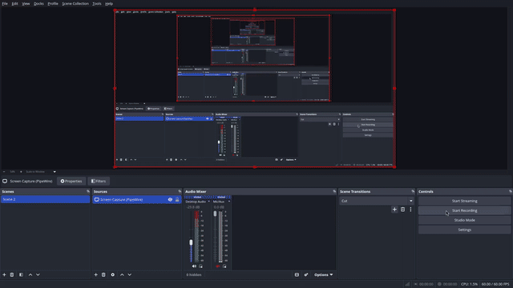
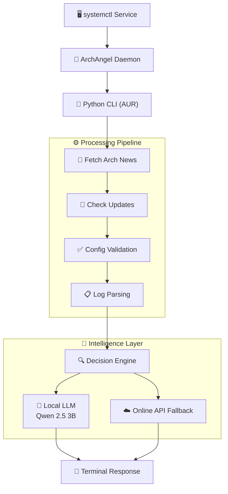

<div align="center">


# ArchAngel

### Your system's guardian angel — AI-powered, local-first, always watching.

*Original artwork: [Dracuria on DeviantArt](https://www.deviantart.com/dracuria/art/Biblically-accurate-angel-951698905)*

---


</div>

---

## 📖 What is ArchAngel?

**ArchAngel** is a system daemon for Arch Linux power users that watches your system so you don't have to. It cross-references Arch News with your installed packages, audits logs in real time, and gives you plain-English answers — before things break.

It runs as a background service, exposes a CLI, and keeps all inference local via Ollama. No account, no subscription, no internet requirement.

> No telemetry. No cloud. No data leaves your machine.

---

## ❓ Why ArchAngel?

Arch Linux is powerful — but unforgiving. Three problems hit every Arch user eventually:

| Pain Point | How ArchAngel Fixes It |
|---|---|
| 💥 **System breaks after update** | Warns you *before* `pacman -Syu` by correlating your packages against Arch News advisories |
| 📚 **Cryptic errors with no context** | Parses kernel, driver, and systemd logs in real time and explains what went wrong in plain English |
| 🤔 **"What command do I run?"** | Acts as a terminal copilot — generates safe, audited commands tailored to your system state |

---

## ⚡ Key Feature: Pre-Emptive Update Auditing

Most tools tell you something broke. ArchAngel tells you something *will* break — before you run the update.

It continuously watches the [Arch Linux News RSS feed](https://archlinux.org/news/), matches advisories against your installed packages, and surfaces actionable warnings at the exact moment they become relevant.

**Real-world example:**
```
┌─ ⚠  ADVISORY DETECTED ──────────────────────────────────────────┐
│  Package   : nvidia 550.x                                        │
│  Installed : yes                                                  │
│  Status    : Arch News reports breakage with KDE Plasma          │
│  Action    : Delay update — or pin with: yay -U nvidia-550.x     │
└──────────────────────────────────────────────────────────────────┘
```

---

## 🚀 Quick Demo
```bash
archangel summary
```
```
⚠  Warning : NVIDIA 550 update may break KDE Plasma
✔  Action  : Delay update or pin version

● System Status   : Healthy
● Pending Updates : 3 (1 flagged)
● Last Audit      : 2 minutes ago
```
```bash
archangel analyze
```
```
Analyzing recent journal entries...

● kernel: ACPI error — likely caused by missing firmware package
  → Suggested fix: sudo pacman -S linux-firmware

● Failed unit: bluetooth.service (exit-code)
  → Suggested fix: sudo systemctl restart bluetooth
```

---

<div align="center">

## 💻️ Video Demo



<br><br>

<a href="Demo.mp4">▶️ Full Video</a>

</div>

## 🏗️ Architecture

ArchAngel follows a **Multi-Agent System** design. Each component is lightweight, isolated, and communicates over clearly defined interfaces.


---

## 🧩 Components

### 🐍 The Brain — Python

| Detail | Value |
|---|---|
| AI Framework | FastAPI |
| LLM Backend | Ollama (`qwen2.5:3b`) |
| Terminal UI | Textual (TUI) |
| HTTP Client | `httpx` |

**Responsibilities:**
- Explain logs and system errors in natural language via local LLM
- Generate safe, audited terminal commands tailored to your system
- Run live system inspections via subprocess
- Render the interactive Textual dashboard with health, alerts, and AI responses

---

### ☕ The Orchestrator — Java (Quarkus)

| Detail | Value |
|---|---|
| Framework | Quarkus 3.x |
| Runtime | JVM (Java 21) |
| Database | H2 (embedded) |
| Port | `9090` |

**Responsibilities:**
- Scrape and parse the Arch Linux News RSS feed
- Detect breaking update advisories and correlate with installed packages
- Maintain a local database of command history and ignored warnings
- Schedule periodic background audits via `@Scheduled`
- Expose REST endpoints consumed by the Python CLI

---

## 🤔 Why Quarkus?

The orchestrator needs to do three things well: run scheduled background tasks, maintain local persistent state, and serve a REST API — all inside a single process with no external infrastructure. Quarkus is built exactly for this.

| Requirement | Why Quarkus |
|---|---|
| 🗓️ **Scheduled background tasks** | Built-in `@Scheduled` annotation — no external cron, no Celery, zero config |
| 🗄️ **Embedded database** | Hibernate ORM + H2 out of the box — persistent state with no database server |
| 🌐 **REST endpoints** | Quarkus REST (RESTEasy Reactive) — zero boilerplate, production-grade performance |
| ⚡ **Fast JVM startup** | Starts in ~2–6s — designed for speed, not app servers |
| 🔁 **Fault tolerance** | SmallRye Fault Tolerance: circuit breakers and retries with a single annotation |
| 📦 **Single deployable** | `quarkus-run.jar` + `quarkus-app/` folder — no container, no app server required |
| 🔍 **Health endpoint** | SmallRye Health exposes `/q/health` natively — systemd `ExecStartPost` can probe it |
| 🧵 **Reactive + blocking I/O** | RSS fetches and DB writes run concurrently without manual thread management |

Python owns AI inference and user interaction. Java owns scheduling, persistence, and the REST layer. Each language is doing the work it is actually good at.

---

## 🛠️ Full Tech Stack

| Layer | Technology | Purpose |
|---|---|---|
| **Daemon** | `systemd` | Process management, auto-restart, boot persistence |
| **Orchestrator** | Java 21 + Quarkus 3.x | RSS scraping, scheduling, REST API, local DB |
| **Persistence** | Hibernate ORM + H2 | Embedded SQL — no external database server needed |
| **AI Brain** | Python 3 + FastAPI | LLM interfacing, log analysis, command generation |
| **LLM Runtime** | Ollama (`qwen2.5:3b`) | 100% local inference, no cloud required |
| **API Fallback** | Configurable (OpenAI-compatible) | Optional online fallback when local model is unavailable |
| **CLI** | Python + Click / Typer | Terminal interface distributed via AUR |
| **TUI** | Textual | Rich interactive terminal dashboard |
| **HTTP Client** | `httpx` (Python) | CLI ↔ Java orchestrator communication on `localhost:9090` |
| **Package Distribution** | `makepkg` / AUR | Arch-native packaging and installation |

---

## 📦 Installation

### Prerequisites
```bash
# Required
sudo pacman -S jre-openjdk python python-pipx

# For AI features
sudo pacman -S ollama
sudo systemctl enable --now ollama
ollama pull qwen2.5:3b
```

### Step 1 — Install the CLI (AUR)
```bash
git clone https://github.com/Kernal-Penguins/Archangel-aur.git
cd Archangel-aur
makepkg -si
```

> If `archangel` is not found after install, run: `pipx ensurepath` and restart your shell.

### Step 2 — Install the Java Daemon
```bash
git clone https://github.com/Kernal-Penguins/ArchAngel.git
cd ArchAngel
```

If you don't have a pre-built `quarkus-run.jar`, build it first:
```bash
cd backend/quarkus-app
mvn package -DskipTests
cd ../..
```

Then install the daemon:
```bash
sudo bash install-service.sh
```

The installer detects the project location automatically, bakes real paths into the systemd unit, and enables the service on boot. No manual configuration needed.

### Step 3 — Verify
```bash
sudo systemctl status archangel
archangel status
```

Expected output:
```
● Java service   OK   (listening on :9090)
● Ollama         OK   (qwen2.5:3b loaded)
```

---

## 🔧 Service Management
```bash
# Check status
sudo systemctl status archangel

# Restart after an update
sudo systemctl restart archangel

# Stop the daemon
sudo systemctl stop archangel

# Follow live logs
journalctl -u archangel -f

# Disable autostart on boot
sudo systemctl disable archangel
```

---

## 🔐 Privacy & Security

- ✅ **100% local inference** — Ollama runs entirely on your machine
- ✅ **No telemetry** of any kind
- ✅ **No cloud APIs** by default — fallback is strictly opt-in
- ✅ **No data leaves your machine**
- ✅ **Runs as your own user** — never root
- ✅ **Systemd-hardened** — `NoNewPrivileges`, `PrivateTmp`, `ProtectSystem=full`

---

## 🤝 Contributing

ArchAngel is a FOSS project and contributions at any level are genuinely welcome — you don't need to be a Java or Python expert to help.

**Good first areas:**
- 🐛 Bug reports — open an issue with `journalctl` output attached
- 📖 Documentation — improve setup guides, add examples
- 🧪 Tests — REST layer and scheduler coverage is thin
- 🎨 TUI — new views, better layouts, colour themes

**Bigger ideas:**
- 🤖 New agents — pacman hooks, GPU monitors, AUR-specific advisories
- ⚡ Quarkus native image compilation (GraalVM) for near-instant startup
- 🔔 Desktop notification support via `libnotify`

Please open an issue before a large PR so the approach can be aligned first. All contributions must respect the GPL v2 license.

---

## 📄 License

**GNU General Public License v2**

This project is free software. You are free to use, study, modify, and distribute it under the terms of the GPL v2.

---

<div align="center">

Built for Arch users, by Arch users. 🐧

**[Report a Bug](https://github.com/Kernal-Penguins/ArchAngel---An-AI-driven-CLI-Assistant-for-arch-based-sytems/issues/new?labels=bug)** · **[Request a Feature](https://github.com/Kernal-Penguins/ArchAngel---An-AI-driven-CLI-Assistant-for-arch-based-sytems/issues/new?labels=enhancement)** · **[AUR Package](https://aur.archlinux.org/packages/archangel-cli)** · **[Arch News](https://archlinux.org/news/)**

</div>
